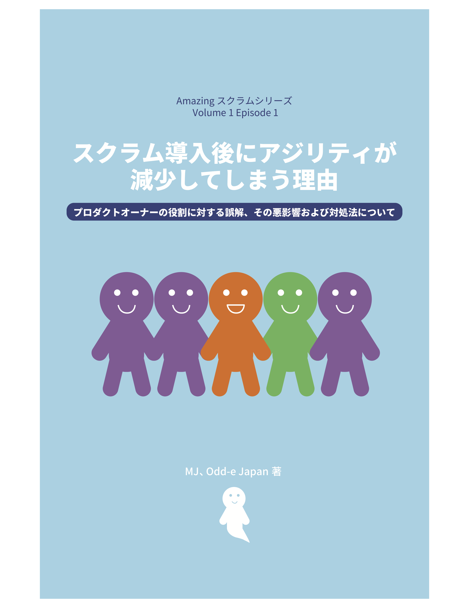
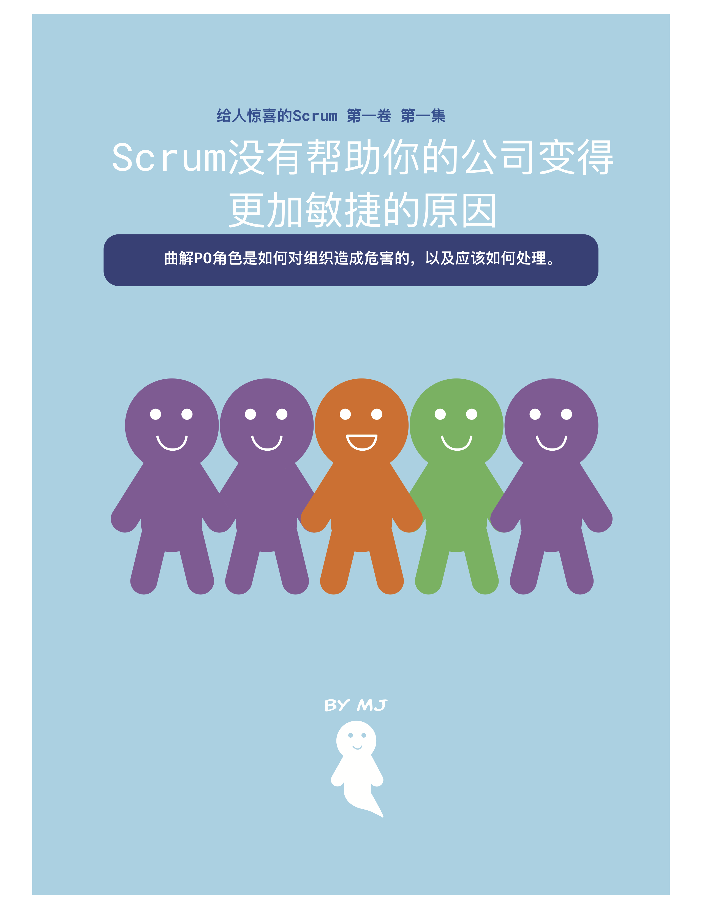

Watch the video:

And/or download the comic book:
 

スクラム導入後にアジリティが減少してしまう理由：プロダクトオーナーの役割に対する誤解、その悪影響および対処法について
 

给⼈人惊喜的Scrum 第⼀一卷 第⼀一集 Scrum没有帮助你的公司变得更更加敏敏捷的原因曲解PO⻆角⾊色是如何对组织造成危害的，以及应该如何处理理。
 

WIP:
* [Pourquoi “Scrum” ne rend pas votre entreprise plus Agile : de quelle manière les idées fausses sur le rôle du Product Owner nuisent à votre organisation, et que faire pour remédier à cette situation.](https://docs.google.com/document/d/13jKXmUA-p2GP1UraZmQ-5SSyhZYcW6J8PzvSaVzPZfc/edit?usp=sharing)  ([Contact me](/contact) to join the French translation volunteers.) 
* [Почему "Скрам" Не Делает Вашу Компанию Достаточно Аджайл:  Как Недопонимание Роли Продукт Овнура Вредит Вашей Организации, И Что С Этим делать](https://docs.google.com/document/d/13jKXmUA-p2GP1UraZmQ-5SSyhZYcW6J8PzvSaVzPZfc/edit?usp=sharing) ([Contact me](/contact) to join the Russian translation volunteers.)
* Warum Scrum allein Ihre Firma nicht sonderlich agil macht: Wie Missverständnisse über die Product Owner Rolle ihrer Organisation schaden - und wie sie sich davor bewahren können ([Contact me](/contact) to join the German translation volunteers.)