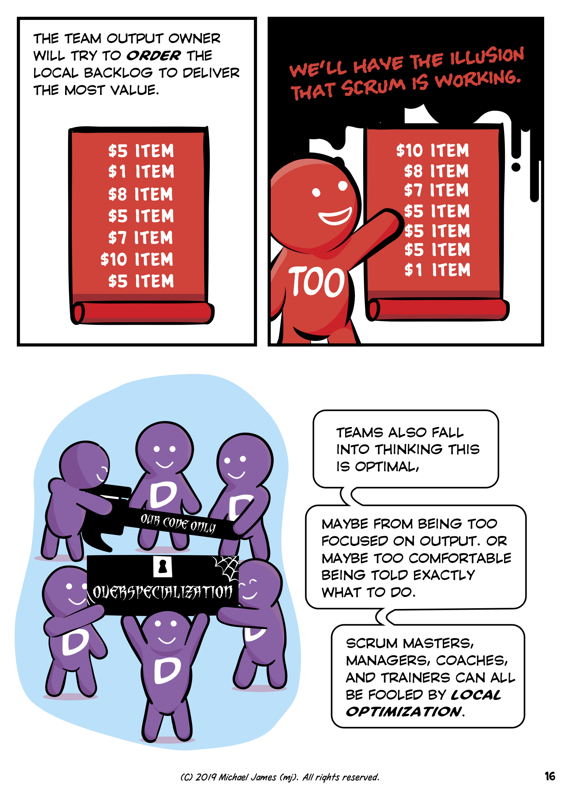
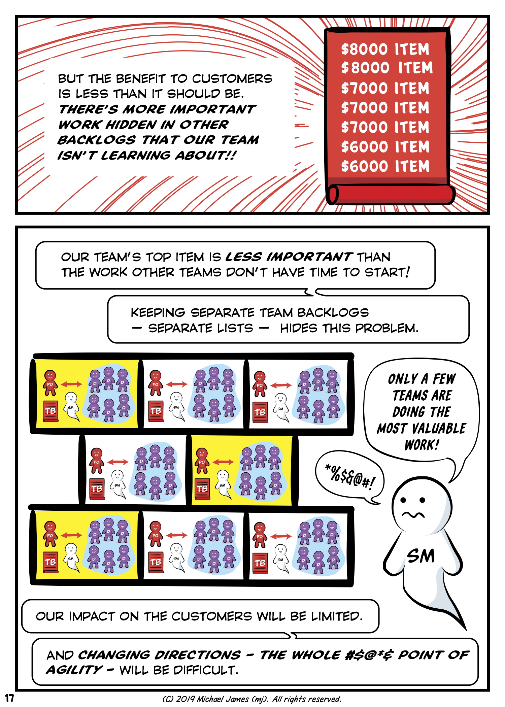

If someone in an seven-team company had only a superficial understanding of Scrum, they might think each team should have its own segregated list of stuff to do.  That keeps them "productive," right?

This is a great idea if your goal is to keep everyone busy.  If your goal is to do the highest priority, highest value work, it could only be justified if several implausible things were true:

1. Each team's backlog would need to contain the *same priority work*, work of equal value.  Team A's #1 item (A-1) would need to have the same customer impact as Team G's #1 (G-1) item.  If you've spent much time with your eyes open in real organizations, you already know that one team's work will be more important in the big picture than another team's work.  In real life it's not hard to imagine the value ratio exceeding 1000 to 1.
2. Each team's sub-list would have to *stay* the same priority over time.  Even as we learned more about customer needs, we would not be able to reprioritize beyond the limited context of each team's list.  We'd have to decide up-front, once and for all, the value of each team's type of work.  This type of "Scrum" would work if we didn't need agility.  Of course we could cheat and move items between Team C and Team D's lists, but that would be admitting that it's really just one list we've artificially segregated.  (The more common form of crypto-reprioritization is to yank key people from one thing to another: *resource management*.  This habit is so widespread, it should be a clue that superficial-Scrum actually *reduces* agility, and managers need a way around it!)
3. Each team would have to complete every item at the same rate.  If Team A started #A-3 before Team B started #B-2, they would be working on the stuff we'd declared lower value at the expense of higher valued work.  Have you ever gotten in line at a grocery store and noticed that latecomers in a different line finished before you?  

There may be other justifications for keeping separate lists.  Maybe they really really really are unrelated products, [though we should be skeptical of this](https://less.works/less/framework/product.html).  Maybe we're bound by overspecialization because the skills and knowledge gaps seem insurmountable.  Maybe we've made a management decision to keep our less capable developers on Team F.  Maybe Teams X and Y are on the other side of the world and we're not willing to give them anything important.  Let's use Ken Schwaber's term for these things: *organizational impediments*.

Gentle reader, I have no idea what you should do in your own situation.  I hope I've at least helped you gain clarity about why Scrum has only one Product Backlog per product, regardless of the number of teams.

Excerpt from [Why “Scrum” Isn’t Making Your Company Very Agile, How Misconceptions About The Product Owner Role Harm Your Organization, And What To Do About It.](/Why-Scrum-Isnt-Making-Your-Company-Very-Agile/).
