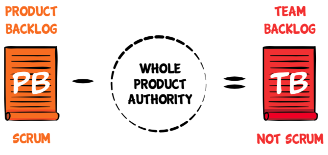
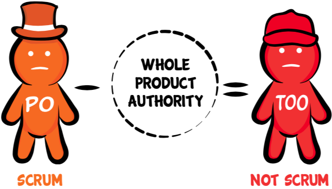

Small teams are great, and mandated by the definition of Scrum.  Scrum also mandates a Product Backlog and Product Owner.  

Most companies have more than 11 people working on any given product.  *Just to make Scrum fit* (a [local optimization](/local-optimization-bias)), they will redefine "Product" to mean something narrower than the actual product that customers and users see.  This is the first step into an Orwellian world where words mean the opposite of their original intent.

The next step is to give each team a "Product Backlog" which astute observers will notice is really only a *Team Backlog*.

And then give each team a separate "Product Owner" who is really just a *Team Output Owner*.

This leaves us with perhaps a dozen independent "Scrum Teams" who managers worry would run around like chickens with their heads cut off unless we pulled them together somehow.  The traditional way of doing this, dating back at least as far as Julius Caesar's army, is to add hierarchical layers.  Humans have trouble thinking of alternatives to hierarchical layers; unfortunately this is what's recommended at the end of Henrik Kniberg's extremely popular Product Owner video (a great video up until the last few minutes).  So now we get "Chief Product Owner" or "Business Owner" or some other way of filling the gap.  

A decendent of the failed Rational Unified Process (RUP) approach called Scale Agile Framework (SAFe) adds a multi-layer stack of traditional management on top of our "Scrum Teams."  Many of you have experienced how much that actually reduces an organization's agility.  

The problem is that this leaves the biggest problems outside of the space of team self organization, and outside the space of single-list prioritization.  With a narrow view of the product, only our toes wind up being Agile.

[Read more about Whole Product Focus](https://less.works/less/principles/whole-product-focus.html)
