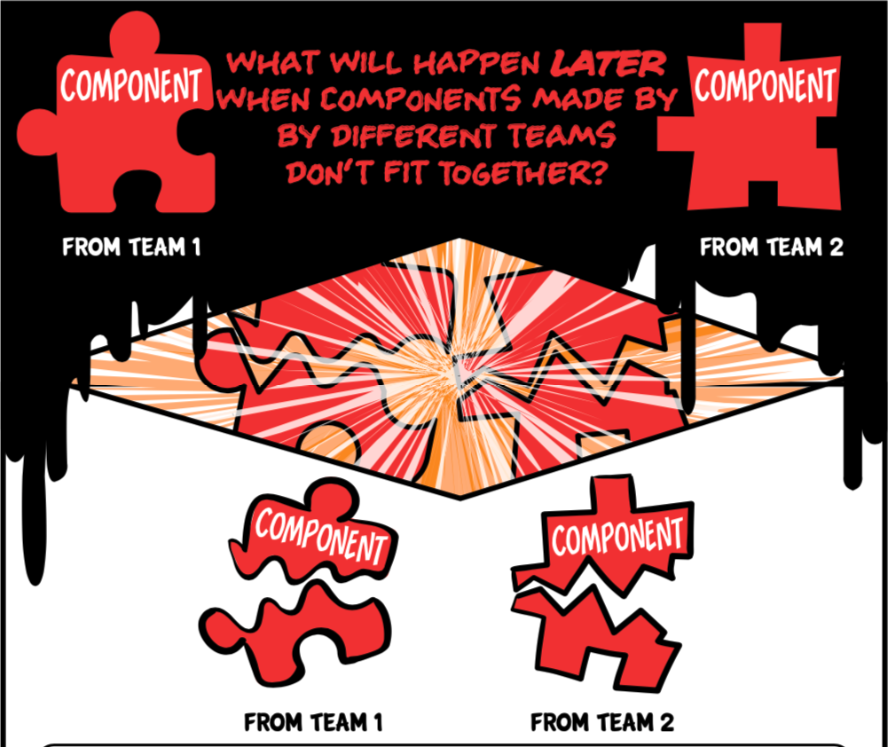
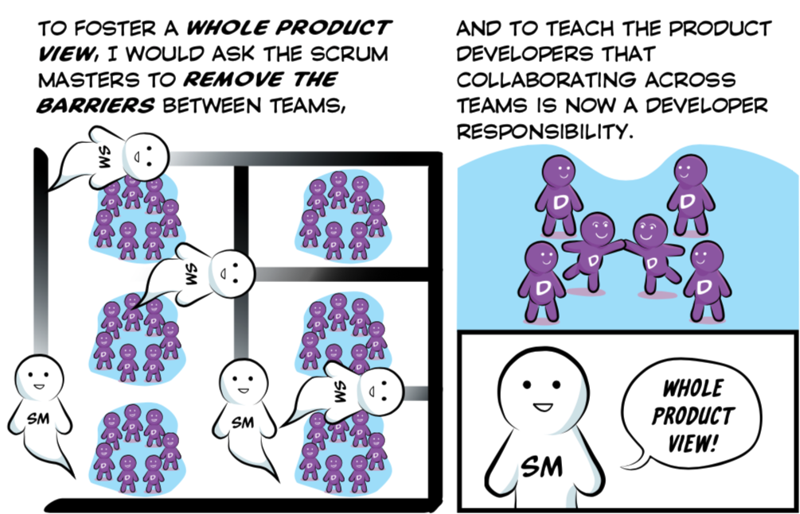

## Misconception 4.1: Will Components From Different Teams Integrate Into A Feature Without Teams Working Together?

By "components" I'm usually referring to architectural layers within the software, such as front end, back end, "platform," a device driver, etc.  Too many large organizations have teams that can only work on components.

*Avoid Component Teams and Delayed Integration*

For Agility, we will usually prefer [feature teams](https://less.works/less/structure/feature-teams.html) who span multiple components and can develop end-to-end, customer centric features in a shared codebase, rather than *component teams* who don't and can't.

*Example Feature Teams*

If we're using modern programming practices (TDD, Continuous Integration, trunk-based development, etc.), transitioning to feature teams *may* reduce the coupling between teams a bit.  But not to zero.  In fact, we should *not* try to reduce team-to-team coupling to zero unless our goal is team "productivity" instead Product Development agility.
> We should *not* try to reduce team-to-team coupling to zero unless our goal is team "productivity" instead Product Development agility.

### Misconception 4.1.1 Doesn't XYZ Technical Approach (This Year It's Microservices) Eliminate The Need For Teams To Work Together?

Not much.

I guess people are getting this idea after watching a Henrik Kniberg video about how Spotify used Chromium Embedded Framework to reduce team interdependencies, or by the way the Microservices approach is sometimes pitched.  Even "Agile tools" (JIRA, etc.) are pitched as ways to eliminate conversations.  It almost sounds like we don't value [individuals and interactions over processes and tools](https://agilemanifesto.org).

### Misconception 4.1.2 Don't Well Defined Interfaces, Open Standards, etc. Eliminate The Need For Teams To Work Together?

Existing APIs work when sharing types of information that have been shared before.  For example, [Traffic Message Channel](https://en.wikipedia.org/wiki/Traffic_message_channel) allows anyone to make devices that are aware of motor vehicle traffic.

But companies want their product to do *newer* things than that, where *both sides* of the interaction are evolving.  If developing a new capability requires sharing new types of information between different parts of software, somehow developers will need to agree how to do it, and what the new types of information mean.

[Teams will need to talk to each other](https://less.works/less/framework/coordination-and-integration.html).  Remember what the [Agile Manifesto](https://agilemanifesto.org/principles.html) has to say about the most effective way of communicating?

* * *

## Misconception 4.2: Will Features From Different Teams Integrate Into A Product Without Teams Working Together?

Feature teams, despite their increased independence, *still* need to collaborate with each other to develop a cohesive product inside and out.

As we continuously integrate into our shared code base (doing trunk-based development of course), how will we keep the internal architecture from turning into a mess?  How will we cross-pollinate the learnings across multiple teams?  How will everyone develop a *Whole Product View*?

Regarding User Interface and User Experience -- have you ever used a product that felt like each part was made by a different designer?  We'll want them to collaborate across teams also.

So Scrum Masters should be encouraging collaboration across teams, just as they encourage collaboration within teams.  Fortunately [there are many better ways to do this than "Scrum of Scrums"](https://less.works/less/framework/coordination-and-integration.html).

## Misconception 4.3: Will Products Sold Separately _Or_ As Parts Of A Suite Integrate Without Teams Working Together?

It would be a bizarre business strategy for a 10-team product company to simultaneously, with the same intensity, develop 10 products that had nothing to do with each other.  (I'm focusing on a real *product company*, not a project-services company making bespoke software for a variety of clients.)  Companies don't gain competitive advantage by making products that don't work together.  (And we might have a few products from the past that we only maintain occasionally.  As discussed in [Misconception #2: Are All Teams Working On Equal Value Stuff?](/misconception-2-all-teams-are-working-on-equal-value/), they won't all warrant the same amount of attention.)

Except in trivial cases where we aren't doing anything new, engineering effort will be required to ensure the products work together properly.  Take Adobe products (please):  The value of Adobe Creative Cloud products I use is related to how well the integration works (or doesn't work) between them.  In some cases I can substitute incompatible products in my workflow by using the lowest-common-denominator interface, but it usually adds hassle and reduces capabilities.  They won't improve their product suite by ignoring integration amongst their products.  

One of my clients is in a domain largely devoid of prior standards and APIs because no one else has done what they're doing.  They have a few hundred developers working on what used to be a dozen distinct products.  But they know their real competitive advantage will come when customers see the whole suite as one integrated product.  These products weren't initially developed to work together.  For them it's worth the millions of dollars of effort they're expending to make them work together inside and outside.  It would be harmful to send them a typical Agile coach or Scrum trainer who is going to focus them on individual team productivity -- like I used to 15 years ago -- rather than the whole product.

Agility in a *real product company*, with more than 12 people, entails teams working with teams.
