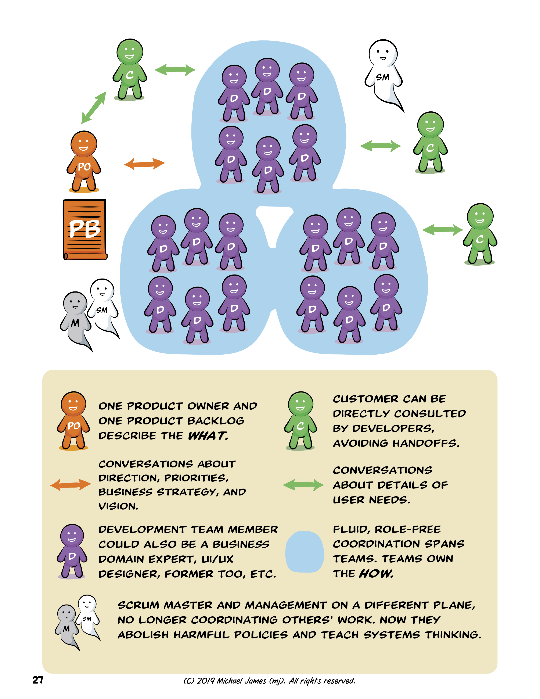

## Misconception 4.1: Will Components From Different Teams Integrate Into A Feature Without Teams Working Together?

By "components" I'm usually referring to architectural layers within the software, such as front end, back end, "platform," a device driver, etc.  Too many large organizations have teams that can only work on components.

*Avoid Component Teams and Delayed Integration*

For Agility, we will usually prefer [feature teams](https://less.works/less/structure/feature-teams.html) who span multiple components and can develop end-to-end, customer centric features in a shared codebase, rather than *component teams* who don't and can't.

*Example Feature Teams*

If we're using modern programming practices (TDD, Continuous Integration, trunk-based development, etc.), transitioning to feature teams *may* reduce the coupling between teams a bit.  But not to zero.  In fact, we should *not* try to reduce team-to-team coupling to zero unless our goal is team "productivity" instead Product Development agility.
> We should *not* try to reduce team-to-team coupling to zero unless our goal is team "productivity" instead Product Development agility.

### Misconception 4.1.1: Doesn't XYZ Technical Approach Eliminate The Need For Teams To Work Together?

No.

I guess people are getting this idea by the way the Microservices approach is sometimes pitched, or maybe after watching a Henrik Kniberg video about how Spotify used Chromium Embedded Framework to reduce team interdependencies.  Only two months after publishing this article I heard  someone propose "DDD, CQRS, Event Sourcing, Reactive Systems, Actor model" as ways to eliminate the need for teams to talk to each other.  Remember when people thought RPC, XML, SOAP, etc. were going to eliminate the need for developers to collaborate?  Look how many years people have sought alternatives to working together!  All these things may be wonderful inventions, but successful Agile organizations value [individuals and interactions over processes and tools](https://agilemanifesto.org).

### Misconception 4.1.2: Don't Well Defined Interfaces, Open Standards, etc. Eliminate The Need For Teams To Work Together?

Preexisting APIs share types of information that have been shared before.  For example, [Traffic Message Channel](https://en.wikipedia.org/wiki/Traffic_message_channel) allows anyone to make devices that are aware of motor vehicle traffic.  Preexisting APIs allow old things to be used in new ways.

But companies also want their product to do newer things than that, where *both sides* of the interaction are still changing and old APIs may not suffice.  If developing a new capability requires sharing new types of information between different parts of software, somehow developers will need to agree how to do it, and what the new types of information mean.

[Teams will need to talk to each other](https://less.works/less/framework/coordination-and-integration.html).  Remember what the [Agile Manifesto](https://agilemanifesto.org/principles.html) has to say about the most effective way of communicating?

* * *

## Misconception 4.2: Will Features From Different Teams Integrate Into A Product Without Teams Working Together?

Let's say you've taken the wise step of switching from component teams to [feature teams](https://less.works/less/structure/feature-teams.html).  Your feature teams will *still* need to collaborate with each other to develop a cohesive product inside and out.

As we continuously integrate on the trunk into our shared code base, [how will we keep the internal architecture and shared data from turning into a mess](https://less.works/less/technical-excellence/architecture-design.html)?  (If your answer included the word "Microservices," please re-read the previous sections.)  How will we cross-pollinate the learnings across multiple teams?  How will everyone develop a *Whole Product View*?

The examples most obvious to a non-programmer may be User Interface and User Experience.  Have you ever used a product that felt like each part was made by a different designer?  If we want to make a cohesive product, we'll want team members involved in UI/UX to collaborate across team boundaries also.

So Scrum Masters should be encouraging collaboration across teams, just as they encourage collaboration within teams.  Fortunately [there are many better ways to do this than "Scrum of Scrums"](https://less.works/less/framework/coordination-and-integration.html).

* * *

## Misconception 4.3: Will Products Sold Separately _Or_ As Parts Of A Suite Integrate Without Teams Working Together?

It would be a bizarre business strategy for a 10-team product company to simultaneously, with the same intensity, develop 10 products that had nothing to do with each other.  (I'm focusing on a real *product company*, not a project-services company making bespoke software for a variety of clients.)  Companies don't gain competitive advantage by making products that don't work together.  (And we might have a few products from the past that we only maintain occasionally.  As discussed in [Misconception #2: Are All Teams Working On Equal Value Stuff?](/misconception-2-all-teams-are-working-on-equal-value/), they won't all warrant the same amount of attention.)

Except in trivial cases where we aren't doing anything new, engineering effort will be required to ensure the products work together properly.  Take Adobe products (please):  The value of the various Adobe products I use is related to how well the integration works (or doesn't work) between them.  In some cases I can substitute incompatible products in my workflow by using the lowest-common-denominator interface, such as saving a .WAV or .SVG file to disk, then importing it in the otherwise-incompatible tool.  But that usually adds hassle and reduces capabilities.  Companies won't improve their product suite by ignoring integration amongst their products.  

One of my clients is in a domain largely devoid of prior standards and APIs because (unlike Adobe) no one else has done what they're doing.  They have a few hundred developers working on what used to be a dozen distinct products.  But they know their real competitive advantage will come when customers see the whole suite as one integrated product.  These products weren't initially developed to work together.  For them it's worth the millions of dollars of effort they're expending to make them work together inside and outside.  It would be harmful to send them a typical Agile coach or Scrum trainer who is going to focus them on individual team productivity -- like I used to 15 years ago -- rather than the whole product.

## History Of Attempts To Eradicate This Misconception

Here are [NATO conference notes from 1968](http://homepages.cs.ncl.ac.uk/brian.randell/NATO/nato1968.PDF) pointing out how silly it is to believe the following:

> Interfacing this system to the rest of the software is trivial and can be easily worked out later.

If we have more than 12 people in a product company, we want teams working with teams (and customers).

