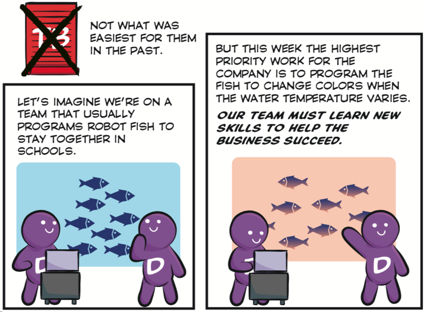

Watch out for *private code policies and practices*.  Tying particular people or teams to particular parts of the code has several negative impacts:

1. Teams don't work in priority order.  Some teams or individuals do lower valued work, creating *inventory*.  Other teams or individuals become bottlenecks, causing *Work In Progress* (WIP) queues and delaying end-to-end cycle time.
2. In dark corners, our code starts to stink.  Fewer people see it, write tests for it, and refactor[^1] it.  A lack of automated tests makes *continuous integration* more difficult and *continuous delivery* impossible.  The lack of automated tests makes it even scarier for other people to change the code (for fear of introducing regression failures).  The lack of refactoring makes the code difficult to understand and change.  If sunlight is the best disinfectant, private code practices are the best incubator for code rot.  Taken together, these things discourage other people from working on the code, which makes it stink even more.
3. Our knowledge and skills do not improve as much as they would when we see other parts of the system.  In our little bubble, we have no idea how much else there is to learn about software development.
4. Ultimately the customer suffers and our company becomes less competitive.

* * *

## Possible Remedies

Craig Larman and Bas Vodde have written the most comprehensive list of remedies to the My Code, Your Code problem that I've seen:
<https://less.works/less/technical-excellence/architecture-design.html#Behavior-OrientedTips>.

[^1]: The purpose of source code is not only to communicate with the computer running the program.  Source code should also communicate with the people working on it, now and in the future.  As properly defined by Martin Fowler, to *refactor* means to improve the design of existing code, generally in tiny incremental steps, to keep it understandable and maintainable, without changing behavior.  Refactoring is not practical unless we're writing automated tests as we write the code.

* * *

