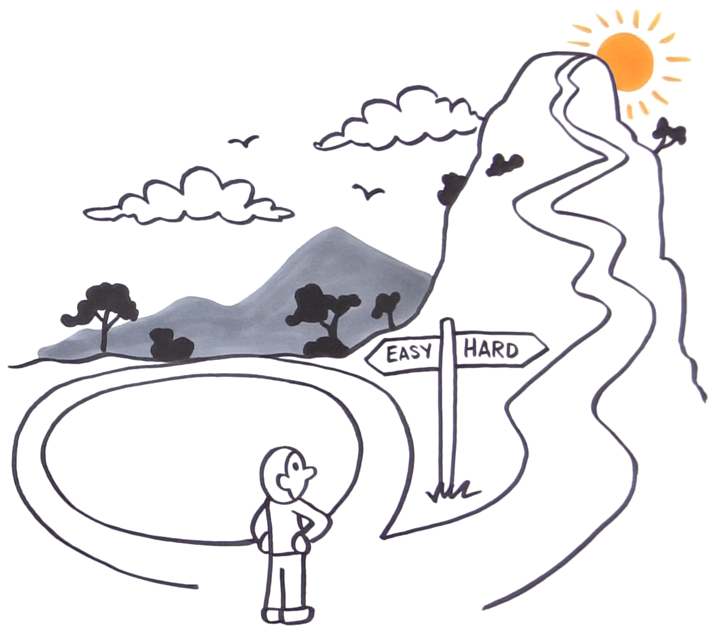

I've listed some things that are intentionally not part of Scrum, and may contradict it or make it less useful.  

What does it matter?  It's not like the Scrum cops will throw you in jail.  But organizations do things mindlessly -- unintentionally -- because they got the impression they were essential to Scrum.  For each one, please think about what problem it is meant to solve and whether there are solutions more consistent with your [system optimization goal](/you-wont-change-your-organization-without-an-optimization-goal/).

Scrum does NOT contain the following:
* [daily status meeting](#scrum-does-not-contain-a-daily-status-meeting)  
* [velocity](#scrum-does-not-contain-velocity)
* [Story Points, Fibonacci numbers](#scrum-does-not-contain-story-points-and-fibonacci-numbers)
* [Scrum of Scrums](#scrum-does-not-contain-scrum-of-scrums)
* [multiple Product Owners per product (e.g. one per team)](#scrum-does-not-have-multiple-product-owners-per-product)
* [tasks in the Product Backlog](#scrum-does-not-have-tasks-in-the-product-backlog)
* [extra roles such as Chief Product Owner and Release Train Engineer](#scrum-does-not-contain-extra-roles)
* [burndown chart as a management report, or at all](#scrum-does-not-contain-burndown-charts)
* [Scrum Master as coordinator, motivator, or status reporter](#scrum-masters-are-not-for-coordination-motivation-or-status-reporting)

Scrum was intended to be a framework, a meta-process, to connect feedback loops and give people control over their own work.  What you've experienced as Scrum in your workplace has likely diverged far from those intentions.

## Scrum Does Not Contain A Daily Status Meeting

Schwaber [writes](/https://scrumguides.org/scrum-guide.html#daily-scrum)

> The purpose of the Daily Scrum is to inspect progress toward the Sprint Goal and adapt the Sprint Backlog as necessary, adjusting the upcoming planned work.
> 
> The Daily Scrum is a 15-minute event for the Developers of the Scrum Team. The Developers can select whatever structure and techniques they want, as long as their Daily Scrum focuses on progress toward the Sprint Goal and produces an actionable plan for the next day of work.
> 
> The purpose of the Daily Scrum is to inspect progress toward the Sprint Goal and adapt the Sprint Backlog as necessary, adjusting the upcoming planned work.

Do I need to say anything more?  Companies that don't treat the Daily Scrum as a self organization, *re-planning* event are likely to call it a "stand up" for people to give status reports.

## Scrum Does Not Contain "Velocity"

Schwaber's definition of Scrum has never contained "velocity."  It is a practice sometimes borrowed from Extreme Programming.  But even the Extreme Programming people who came up with the idea now have regrets.  Should you keep doing it?  I'd rather you focused on keeping your product shippable *all the time*.  Focusing on velocity is a [local optimization](/local-optimization-bias) that can be bad for business outcomes.  See [Why I Barely Mention Velocity Anymore](/why-i-barely-mention-velocity-anymore).

## Scrum Does Not Contain Story Points and Fibonacci numbers

Scrum does not contain any particular effort estimation scheme.  The Scrum Guide barely mentions estimation at all.

Yes, there's a strong case for relative exponential estimates over absolute estimates.  Do you really need a vast array of [Fibonacci numbers](/cult-of-fibonacci)?  You're doing this because someone told you Fibonacci numbers have magical powers?  Do you also believe in astrology?

Cool programmers use powers of two.  And if you're using more than a few choices, you're probably just creating the pretense of precision.

## Scrum Does Not Contain "Scrum of Scrums"

The first Scrum book in 2001 did contain a "Scrum of Scrums" -- a hasty stab at the problem that no one knew how to make organizations agile.  But Ken Schwaber's next book, in 2004, identified the ways it contradicted team self organization.  Fortunately there are [alternatives to Scrum of Scrums](/seven-alternatives-to-scrum-of-scrums).

## Scrum Does Not Have Multiple Product Owners Per Product

Per the [Definition of Scrum](/https://scrumguides.org/scrum-guide.html#scrum-team)

> If Scrum Teams become too large, they should consider reorganizing into multiple cohesive Scrum Teams, each focused on the same product. Therefore, they should share the same Product Goal, Product Backlog, and Product Owner.

Why is it harmful to have multiple POs per product?  See [my comic book](/Why-Scrum-Isnt-Making-Your-Company-Very-Agile/).

## Scrum Does Not Have Tasks In The Product Backlog

One clue that someone hasn't yet gotten the point of Scrum is that they refer to "tasks" in the Product Backlog.  

Scrum has historically separated the *what* from the *how*.  *How* to solve problems is left to self-managing cross-functional teams.  If you cannot do this, you do not yet have self-managing cross-functional teams.  Thus, the items in the Product Backlog are properly called *Product Backlog Items* (or PBIs), and never "tasks."  

We'll give you a pass if you refer to Product Backlog Items as "User Stories," but we want you to be aware this is actually an Extreme Programming concept that many Scrum teams borrow.  How to create well-formed Product Backlog Items is covered in detail in the [Scrum Training Series](https://scrumtrainingseries.com/BacklogRefinementMeeting/).

A team may decide to create Sprint Tasks when planning a Sprint -- again covered by the [Scrum Training Series](https://scrumtrainingseries.com/SprintPlanningMeeting/).  We try to defer *how* decisions until the *last responsible moment*.

## Scrum Does Not Contain Extra Roles

Since a product has only one Product Owner, there is [no "Chief Product Owner"](/Why-Scrum-Isnt-Making-Your-Company-Very-Agile/).

There is no "Release Train Engineer" because integration is a team responsibility.  Giving responsibilities to named roles takes them away from teams, making teams less cross-functional and less self-managing.

Organizations often try to solve problems by creating additional roles, structures, departments, processes, etc.  All of these can be quick fixes with harmful side effects.  We believe in removing that complexity and solving the underlying problems: more with less.

## Scrum Does Not Contain Burndown Charts

While the first Scrum book in 2001 did recommend burndown charts, it was quickly discovered that they could lead to a decrease in team self management through excess focus on estimates and short-term efficiencies.  Complex work doesn't necessarily follow Newton's Laws Of Motion.  So they've been out of Scrum's definition for years.  Use them if you want, and understand why they're no longer prescribed in Scrum.

## Scrum Masters Are Not For Coordination, Motivation, or Status Reporting

The Scrum Master was not intended to be a renamed project manager.

### coordination
The Scrum Master is there to teach the team that coordination is a *team* responsibility.  Doing it for them teaches them the opposite.

### motivation
If people are not motivated, it's likely there are organizational impediments the Scrum Master should be working to address.  In healthy organizations the motivation comes from doing great work and seeing how it helps people.  (You still have to pay us to get us in the door.)

### status reporting
The authors of the Agile Manifesto wrote that [Working software is the primary measure of progress](https://agilemanifesto.org/principles.html).  Scrum emphasizes the empirical over the theoretical.  At the *Sprint Review* everyone sees the product itself, not a report about it.

For more about Scrum Master responsibilities, please see the [Example Scrum Master's Checklist](https://scrummasterchecklist.org).

----

{: .align-center width="400"}